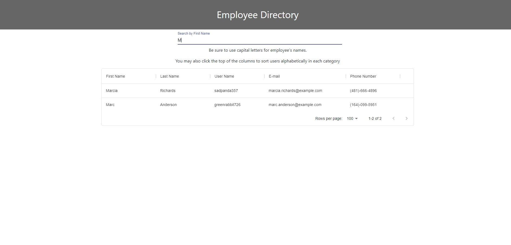

# Budget-Me 

## Table of Contents
1. [Description](#description)
2. [Installation](#installation-instructions)
3. [Usage](#usage-information)
4. [Contribution](#contribution-guidelines)
5. [Test](#test-instructions)
6. [Questions & Contact](#questions?-contact-information-below)
### Description
This app is designed to allow users to see their employee list. It also allows the user to search through the employee list by first name, sorts each category a-z.

### Installation Instructions
Download react and all associated node_modules

### Usage Information
Use "npm start" 

### Contribution Guidelines
See contact information

### Test Instructions
"node server"

### Questions and Contact Information Below
#### Github Username: crystalcrandall92
#### Github Link: https://github.com/crystalcrandall92
#### Email: crystalcrandall92@yahoo.com

